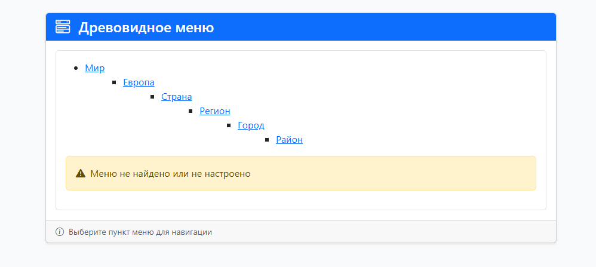

# Древовидное меню для Django

[](https://python.org)
[](https://djangoproject.com)
[](https://www.postgresql.org)
[](https://www.docker.com)

## Требования
- Python 3.12
- Наличие Docker Desktop 

## 🌟 О приложение

Был разработан шаблонный тег `draw_menu` для древовидного отображения меню. Тег принимает название меню `Menu.name`

```html
 <div>
    
 </div>
```

## 🛠 Технологический стек
- Django 
- PostgreSQL 
- Bootstrap 
- Docker

## 🚀 Быстрый старт с Docker

1. Клонируйте репозиторий:
```bash
git clone https://github.com/KnightCode1024/tree-menu.git
cd tree-menu
```

2. Сборка и запуск приложение:
```bash
    docker-compose up --build
```

3. Посмотреть результат на http://127.0.0.1:8000/
